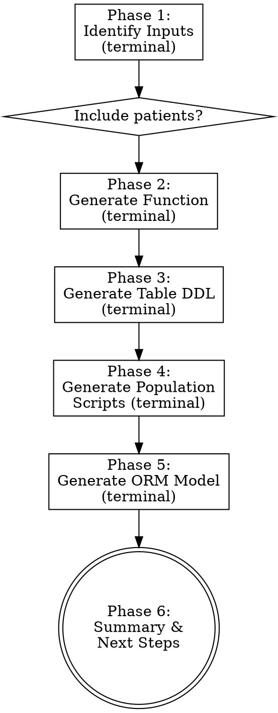

# Create OpenLDR Analytics Dataset

Generate analytics dataset tables from existing OpenLDR SQL views. Produces four artifacts: a table-valued function, a CREATE TABLE DDL, population scripts, and a Python ORM model.

**Announce:** "I'm using the openldr:create-dataset skill to generate an analytics dataset."

## Prerequisites

The test type must have existing SQL views (created via `openldr:create-view` or already in the database). The skill needs to know which views exist before it can generate the dataset.

## Process

## Phase 1: Identify Inputs

Ask these questions one at a time in the terminal:

1. **Test type** — Which test? (HIV VL, HIV EID, TB GeneXpert, CD4, CrAg, TB-LAM)
2. **Existing views** — Which views exist? (e.g., viewVL_Info + viewVL_Result)
3. **Include patient data?** — **PRIVACY GATE: This question is MANDATORY.** Always explain the implications:
   - Yes: adds ~20 patient columns (name, DOB, phone, national ID). Required for SMS notifications and patient-level reports.
   - No: lighter dataset with only test results, demographics, and facility data. Suitable for aggregate analytics.
4. **Target database and table** — Suggest based on convention (e.g., VlData in ViralLoadData)
5. **Bind key** — Suggest based on test type (vl/vlSMS, dpi, tb, ad)

Then load `references/dataset-generation-guide.md` for templates.

## Phase 2: Generate Table-Valued Function

Build the function using the template from the reference guide. The function accepts `@startDate` and `@endDate` parameters and returns a flat result set.

**Block structure:**
- A: Patient columns (only if patients included)
- B: Demographics from Result view
- C: Pre-registration timeline (from Info view)
- D: Core timeline dates
- E: Pivoted info columns with `ISNULL(..., 'Unreported')` defaults
- F: Pivoted result columns
- G: Request metadata passthrough
- H: Facility columns with dictionary lookups (GPS, national codes)
- I: Remaining request metadata
- J: Derived/computed columns (AgeGroup, date parts, DISA flags, DateTimeStamp)

**Critical rules:**
- `INNER JOIN` on Result view (requests MUST have results)
- `LEFT JOIN` on Info view (info may be missing)
- `LEFT JOIN` on Patients (if included)
- `DISTINCT RequestID` in the date-filtered subquery
- Date filter: `OR` on `Requests.DateTimeStamp` AND `LabResults.DateTimeStamp`
- Computed columns always come LAST

Output the SQL and ask the user to review before proceeding.

## Phase 3: Generate Table DDL

Mirror the function output column-by-column, with one addition: `[id] BIGINT IDENTITY(1,1) NOT NULL` as primary key.

**Column type mapping:**
| Function Output | Table Type | Why |
|----------------|-----------|-----|
| `ISNULL(col, 'Unreported')` | `NOT NULL` | ISNULL guarantees a value |
| `CONCAT(...)` | `NOT NULL` | CONCAT never returns NULL |
| Scalar function return | Match return type | e.g., `nvarchar(64)` for GetAgeGroup |
| Direct column pass-through | `NULL` | May be missing in source |

Add operational columns at the end: `EPTS`, `EPTS_DATETIME`, `SMS_NOTIFICATION`, `SMS_NOTIFICATION_DATETIME`, `CreatedAt`.

## Phase 4: Generate Population Scripts

Generate two scripts:
1. **Initial population** — `INSERT...SELECT` with full date range (2016-01-01 to GETDATE())
2. **Incremental update** — `DELETE + INSERT` pattern using `MAX(DateTimeStamp)` from the target table

## Phase 5: Generate Python ORM Model

Create a SQLAlchemy model class:
- `__bind_key__` matching `configs/paths.py`
- `__tablename__` matching the DDL table name
- All columns with proper SQLAlchemy types (`db.String`, `db.Integer`, `db.DateTime`, `db.Float`, `db.Boolean`)
- Save to `api_openldr_python/{module}/models/`

**Bind key reference:**
| Test Type | Bind Key | Module Path |
|-----------|----------|-------------|
| HIV VL | vlSMS | hiv/vl/models/ |
| HIV EID | dpi | hiv/eid/models/ |
| TB GeneXpert | tb | tb/gxpert/models/ |
| HIV AD (CD4/CrAg/TB-LAM) | ad | hiv/ad/{test}/models/ |

## Phase 6: Summary & Next Steps

List all generated artifacts with file paths. Suggest invoking `openldr:query-api` to test the new data.

## Anti-Rationalization

| Thought | Reality |
|---------|---------|
| "Patient data is fine to include by default" | Always ask. Privacy is non-negotiable. |
| "LEFT JOIN on Result view is safer" | Requests without results produce useless rows. INNER JOIN. |
| "I can skip the DISTINCT" | Multiple panels/results per request cause duplicates. Always DISTINCT. |
| "The operational columns aren't needed" | EPTS and SMS columns are used by downstream systems. Include them. |
