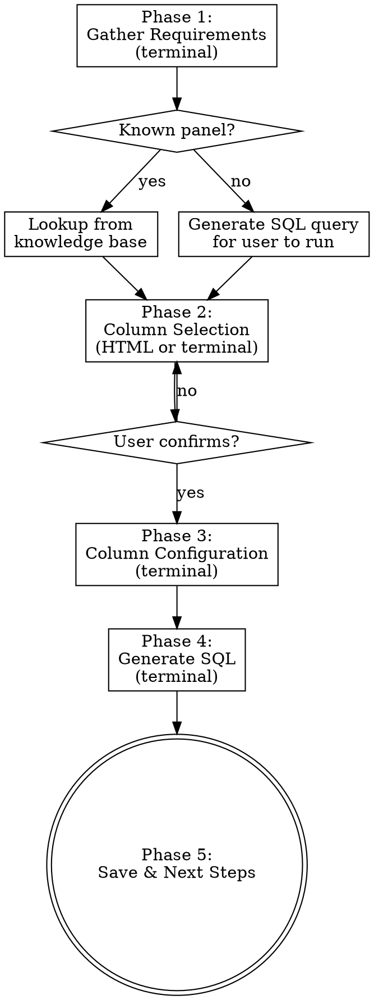

# Create OpenLDR SQL View

Create SQL views that pivot vertical LabResults rows (one row per observation) into horizontal columns (one column per observation) for reporting and analytics.

**Announce:** "I'm using the openldr:create-view skill to create an OpenLDR SQL view."

<HARD-GATE>
Do NOT generate any SQL until the user has confirmed their column selection. No exceptions.
</HARD-GATE>

## Process



## Database Connectivity

The skill works **offline-first** using the built-in knowledge base for known panels. For unknown panels or live validation, it can query the databases directly.

**Credentials** are loaded automatically from (first match wins):
1. `.env` in the current working directory (project-specific)
2. `~/.openldr.env` (global — works from any directory)
3. Shell environment variables (from `~/.bashrc` etc.)

Create a `.env` file with:
```
OPENLDR_DB_HOST=localhost
OPENLDR_DB_USER=your_username
OPENLDR_DB_PASSWORD=your_password
OPENLDR_DB_DICT=OpenLDRDict
OPENLDR_DB_DATA=OpenLDRData
```

**Helper script** — `scripts/query-db.sh` provides these commands:

```bash
scripts/query-db.sh test                    # Test connectivity
scripts/query-db.sh panels                  # List all panel codes from DB
scripts/query-db.sh observations VIRAL      # Get observation codes for a panel
scripts/query-db.sh query dict "SELECT ..." # Run arbitrary query on dict DB
scripts/query-db.sh query data "SELECT ..." # Run arbitrary query on data DB
```

**When to use live DB vs knowledge base:**
- Known panel (VIRAL, HIVVL, PCRGX, etc.) → use `references/view-creation-guide.md` (no DB needed)
- Unknown panel → check if DB env vars are set. If yes, run `scripts/query-db.sh observations {PANEL}`. If no, generate the SQL query for the user to run manually.
- Validating a view → use `scripts/query-db.sh query data "SELECT TOP 5 * FROM {viewName}"`

## Phase 1: Gather Requirements

Ask these questions one at a time in the terminal:

1. **Panel code** — What LIMSPanelCode? (e.g., VIRAL, HIVVL, PCRGX, FSR, PCR, CD4, CRAG, TBLAM, MTXDR)
2. **View type** — Info (registration metadata), Result (test results), or Combined?
3. **View name** — Suggest based on convention: `view{Test}_Info`, `view{Test}_Result`, `view{Test}`

After gathering answers, load the reference guide:
- Read `references/view-creation-guide.md` to get observation codes for the panel
- If the panel is NOT in the knowledge base:
  - **If DB env vars are set:** run `scripts/query-db.sh observations {PANEL_CODE}` to discover codes
  - **If DB env vars NOT set:** generate this query for the user to run manually:

```sql
SELECT DISTINCT LIMSObservationCode, LIMSObservationDesc
FROM [OpenLDRDict].[dbo].[LIMSPanelCodes]
WHERE LIMSPanelCode = '{PANEL_CODE}'
ORDER BY LIMSObservationCode
```

Parse the results (from script output or user paste) and proceed.

## Phase 2: Column Selection

**With browser available:** Use the visual companion to show an HTML column selector page. Generate the HTML dynamically using the `scripts/column-selector.html` template pattern. Group observation codes by domain. Each item shows: code, proposed alias, description, NULL default. Include a Submit button. Read selections from `$STATE_DIR/events`.

**Without browser (fallback):** Present columns as a numbered list in the terminal:

```
Observation codes for panel VIRAL:

Patient Clinical Status:
  1. ENCON → Pregnant ("Is patient pregnant?") [Default: 'Unreported']
  2. AMAME → BreastFeeding ("Is patient breastfeeding?") [Default: 'Unreported']
  3. VIRAP → FirstTime ("First VL test?") [Default: 'Unreported']

Specimen Collection:
  4. LABDA → CollectedDate ("Date of collection") [Default: 'Unreported']
  5. LABHO → CollectedTime ("Time of collection") [Default: NULL]
  ...

Select columns (numbers, ranges, or "all"): 1-4,6,8-16
```

Wait for user confirmation before proceeding.

## Phase 3: Column Configuration

For each selected column, confirm in terminal:
- **Column alias** — Accept default or customize
- **NULL handling** — `'Unreported'`, `NULL`, or custom default
- **Value transformation** — Any CASE expression or scalar function (e.g., `GetReasonForTest()`)

Then ask about optional features:
- Include GPS coordinates? (adds HFLattLong joins)
- Include DISA Link/POC flags? (adds DisaLink/DisaPoc joins)
- Include RequestingFacilityNationalCode?

## Phase 4: Generate SQL

Generate the complete `CREATE VIEW` SQL following the standardized template from `references/view-creation-guide.md`. The view MUST have these sections in order:

1. Request identification (RequestID, OBRSetID, LIMSPanelCode, LIMSPanelDesc)
2. Demographics (AgeInYears, AgeInDays, HL7SexCode)
3. Pre-registration fields
4. Key dates and rejection
5. **Pivoted observation columns** (the user's selected columns)
6. Timestamps and versioning
7. Additional request metadata
8. **Facility resolution** (4 facility types with cascade patterns)
9. Remaining request fields
10. DISA flags (if enabled)

**Critical rules:**
- Observation subqueries: `SELECT RequestID, OBRSetID, LIMSRptResult` (never `SELECT *`)
- Always LEFT JOIN observations (never INNER JOIN)
- Always join on BOTH `RequestID` AND `OBRSetID`
- Facility patterns: A (simple) for LIMS/Requesting, B (DisaPoc fallback) for Receiving, C (3-level cascade) for Testing
- Include `DisapocState = 1` filter on DisaPoc joins

## Phase 5: Save & Next Steps

- Save the SQL to a user-specified file path
- Suggest invoking `openldr:create-dataset` to build the analytics table from this view

## Anti-Rationalization

| Thought | Reality |
|---------|---------|
| "I know which columns they want" | Show the selector. Always. |
| "SELECT * is fine for subqueries" | It pulls unnecessary columns. Use specific columns. |
| "INNER JOIN on observations is OK" | Missing observations drop entire requests. Always LEFT JOIN. |
| "DisaPoc state filter isn't needed" | Without it, inactive POC sites return wrong facility names. |
| "The view is simple enough without sections" | Sections make views maintainable. Follow the template. |
