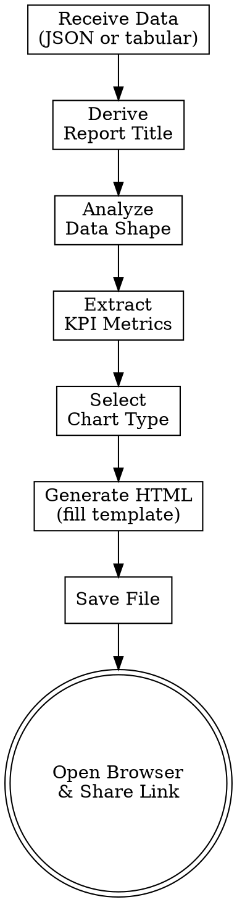

# Generate OpenLDR HTML Report

Generate a self-contained HTML report from OpenLDR analytics data — KPI cards, Chart.js charts, sortable tables — and open it in the user's browser.

**Announce:** "I'm using the openldr:report skill to generate an HTML report."

## Process



## Phase 1: Receive Data

The skill accepts data from three sources:

1. **API response** — JSON returned by `openldr:query-api` (array of objects or summary indicators)
2. **DB query result** — tabular output from `openldr:create-dataset` or a direct SQL query
3. **Conversation context** — data the user has pasted or described in the current session

Collect the following before proceeding:

- **Data** — the raw records or summary figures
- **Title** — report subject (derive from endpoint name or user request if not stated)
- **Date range** — interval covered by the data (extract from API params or ask)
- **Source description** — endpoint path, view name, or "user-provided data"

## Phase 2: Analyze Data & Select Visualization

Load `references/report-generation-guide.md` and apply the 7 mapping rules to choose the correct chart type and layout.

| Rule | Condition | Visualization |
|------|-----------|---------------|
| 1 | Single aggregate values (count, rate, %) | KPI cards |
| 2 | Values over time (monthly/weekly series) | Line chart |
| 3 | Comparison across categories (facilities, provinces) | Bar chart |
| 4 | Part-of-whole breakdown (≤ 8 slices) | Pie / doughnut chart |
| 5 | Two continuous variables with correlation | Scatter plot |
| 6 | Distribution across ordered ranges (age bands, TAT buckets) | Histogram / bar chart |
| 7 | Mixed: summary header + breakdown rows | KPI cards + bar chart |

Apply all matching rules — a report may contain multiple chart types. Always append a sortable data table regardless of which charts are selected.

## Phase 3: Generate HTML

Follow the 5-step process defined in `references/report-generation-guide.md`:

1. **Load the template** — use the dark dashboard template from the guide
2. **Inject metadata** — title, date range, source description, generation timestamp
3. **Build KPI cards** — one card per top-level aggregate metric
4. **Build chart blocks** — one `<canvas>` + Chart.js dataset object per chart type selected
5. **Build data table** — sortable `<table>` with all raw records; include a search/filter input

<HARD-GATE>
Always include the data table, even when charts are present.
</HARD-GATE>

<HARD-GATE>
The HTML must be fully self-contained — all CSS inline, Chart.js loaded via CDN script tag, data embedded in a script block. The file must work when opened directly via file:// protocol.
</HARD-GATE>

## Phase 4: Save & Open

### Default behavior

1. Generate a filename: `openldr-report-{YYYY-MM-DD}-{slug}.html` (slug derived from report title)
2. Write the file to the current working directory
3. Run `scripts/open-report.sh` to open the file in the user's default browser
4. Share the full file path as a clickable link

### Custom output

Use `--output-dir` to write to a specific directory and `--name` to set the filename:

```bash
scripts/open-report.sh --output-dir ~/reports --name vl-suppression-2024.html
```

### Script usage examples

```bash
# Open the most recently generated report
scripts/open-report.sh

# Open a specific file
scripts/open-report.sh path/to/report.html

# Write to a custom directory and open
scripts/open-report.sh --output-dir ~/reports --name my-report.html
```

## Anti-Rationalization

| Temptation | Reality |
|------------|---------|
| "I'll just show the data in a markdown table" | The user asked for HTML. Generate the report. |
| "The data is too simple for a chart" | Apply the mapping rules. Even simple data benefits from KPI cards. |
| "I'll skip the table since the chart shows everything" | Always include the data table. It's mandatory. |
| "I don't need to open the browser" | Always open the browser and share the link. That's the deliverable. |
| "I can use my own HTML template" | Use the template from report-generation-guide.md. It ensures consistency. |
