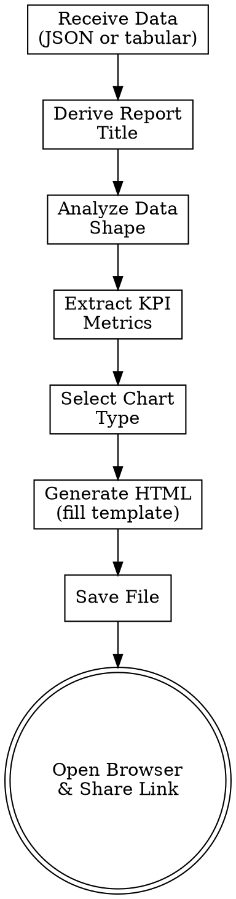

# OpenLDR Report Skill — Implementation Plan

> **For agentic workers:** REQUIRED SUB-SKILL: Use superpowers:subagent-driven-development (recommended) or superpowers:executing-plans to implement this plan task-by-task. Steps use checkbox (`- [ ]`) syntax for tracking.

**Goal:** Create an `openldr-report` subskill that generates self-contained HTML report pages with a dark dashboard theme, Chart.js charts, and sortable data tables for OpenLDR analytics data.

**Architecture:** New `openldr-report/` skill directory following the existing pattern (SKILL.md + references/ + scripts/). The skill receives structured data from `openldr-query-api` or `openldr-explore`, auto-selects the best chart type, and generates a single HTML file that opens locally in the browser.

**Tech Stack:** Chart.js (via CDN), inline CSS, vanilla JavaScript, Bash (open-report.sh helper)

---

### Task 1: Create `open-report.sh` helper script

**Files:**
- Create: `openldr-report/scripts/open-report.sh`

- [ ] **Step 1: Create the scripts directory**

```bash
mkdir -p openldr-report/scripts
```

- [ ] **Step 2: Write `open-report.sh`**

Create `openldr-report/scripts/open-report.sh` with this content:

```bash
#!/usr/bin/env bash
# =============================================================================
# open-report.sh — OpenLDR Report File Handler
#
# Opens a generated HTML report in the user's default browser and prints the
# file path and URL. Does NOT require database or API credentials.
#
# Usage:
#   ./open-report.sh <file.html>                          # Open existing file
#   ./open-report.sh --output-dir /path/to/dir <file>     # Copy to dir, then open
#   ./open-report.sh --name "my-report" <file>            # Rename and open
#   ./open-report.sh --help                               # Show help
# =============================================================================

set -euo pipefail

# Colors (disabled if not a terminal)
if [ -t 1 ]; then
  RED='\033[0;31m'; GREEN='\033[0;32m'; YELLOW='\033[0;33m'; NC='\033[0m'
else
  RED=''; GREEN=''; YELLOW=''; NC=''
fi

show_help() {
  cat <<'HELP'
OpenLDR Report File Handler

COMMANDS:
  <file.html>                          Open an HTML report in the default browser
  --output-dir <dir> <file.html>       Copy report to directory, then open
  --name <name> <file.html>            Rename report (adds .html extension), then open
  --help                               Show this help

OPTIONS:
  --output-dir <dir>   Target directory for the report (default: current directory)
  --name <name>        Custom filename (without .html extension)

EXAMPLES:
  # Open an existing report
  ./open-report.sh /tmp/report.html

  # Copy to ./reports/ and open
  ./open-report.sh --output-dir ./reports /tmp/report.html

  # Save with custom name
  ./open-report.sh --name "vl-suppression-2024" /tmp/report.html

  # Combine options
  ./open-report.sh --output-dir ./reports --name "vl-suppression-2024" /tmp/report.html
HELP
}

open_browser() {
  local file="$1"
  local url="file://$(realpath "$file")"

  # Detect platform and open
  if [ -n "${WSL_DISTRO_NAME:-}" ] || grep -qsi microsoft /proc/version 2>/dev/null; then
    # WSL
    if command -v wslview &>/dev/null; then
      wslview "$url" 2>/dev/null &
    else
      cmd.exe /c start "" "$url" 2>/dev/null &
    fi
  elif [ "$(uname)" = "Darwin" ]; then
    open "$url" 2>/dev/null &
  elif command -v xdg-open &>/dev/null; then
    xdg-open "$url" 2>/dev/null &
  else
    echo -e "${YELLOW}Could not detect browser opener. Open manually:${NC}" >&2
  fi
}

# Parse arguments
OUTPUT_DIR=""
CUSTOM_NAME=""
INPUT_FILE=""

while [ $# -gt 0 ]; do
  case "$1" in
    --output-dir)
      OUTPUT_DIR="$2"
      shift 2
      ;;
    --name)
      CUSTOM_NAME="$2"
      shift 2
      ;;
    --help|-h)
      show_help
      exit 0
      ;;
    *)
      INPUT_FILE="$1"
      shift
      ;;
  esac
done

if [ -z "$INPUT_FILE" ]; then
  echo -e "${RED}Error: No input file specified${NC}" >&2
  echo "Usage: $0 <file.html>" >&2
  exit 1
fi

if [ ! -f "$INPUT_FILE" ]; then
  echo -e "${RED}Error: File not found: ${INPUT_FILE}${NC}" >&2
  exit 1
fi

# Determine target path
TARGET_DIR="${OUTPUT_DIR:-$(pwd)}"
mkdir -p "$TARGET_DIR"

if [ -n "$CUSTOM_NAME" ]; then
  TARGET_FILE="${TARGET_DIR}/${CUSTOM_NAME}.html"
else
  TARGET_FILE="${TARGET_DIR}/$(basename "$INPUT_FILE")"
fi

# Copy to target if different from source
SOURCE_REAL=$(realpath "$INPUT_FILE")
TARGET_REAL=$(realpath -m "$TARGET_FILE")

if [ "$SOURCE_REAL" != "$TARGET_REAL" ]; then
  cp "$INPUT_FILE" "$TARGET_FILE"
fi

# Output info
FULL_PATH=$(realpath "$TARGET_FILE")
echo -e "${GREEN}Report saved:${NC} ${FULL_PATH}"
echo -e "${GREEN}URL:${NC} file://${FULL_PATH}"

# Open in browser
open_browser "$TARGET_FILE"
```

- [ ] **Step 3: Make it executable**

```bash
chmod +x openldr-report/scripts/open-report.sh
```

- [ ] **Step 4: Test the script with --help**

Run: `openldr-report/scripts/open-report.sh --help`

Expected output: The help text showing usage, commands, options, and examples.

- [ ] **Step 5: Commit**

```bash
git add openldr-report/scripts/open-report.sh
git commit -m "feat(openldr-report): add open-report.sh browser helper script"
```

---

### Task 2: Create `report-generation-guide.md` reference

**Files:**
- Create: `openldr-report/references/report-generation-guide.md`

- [ ] **Step 1: Create the references directory**

```bash
mkdir -p openldr-report/references
```

- [ ] **Step 2: Write the report generation guide**

Create `openldr-report/references/report-generation-guide.md` with the following content. This is the core knowledge base — it contains the HTML template, Chart.js configurations, data mapping rules, and color palette that the skill uses to generate reports.

```markdown
# OpenLDR Report Generation Guide

Reference guide for generating self-contained HTML reports with dark dashboard theme, Chart.js charts, and sortable data tables.

## HTML Template Structure

Every report follows this structure. The skill generates the complete HTML by filling in the template sections based on the data.

### Full HTML Template

```html
<!DOCTYPE html>
<html lang="en">
<head>
  <meta charset="UTF-8">
  <meta name="viewport" content="width=device-width, initial-scale=1.0">
  <title>{REPORT_TITLE} — OpenLDR Report</title>
  <script src="https://cdn.jsdelivr.net/npm/chart.js"></script>
  <style>
    *, *::before, *::after { box-sizing: border-box; margin: 0; padding: 0; }

    body {
      font-family: -apple-system, BlinkMacSystemFont, 'Segoe UI', Roboto, 'Helvetica Neue', Arial, sans-serif;
      background: #0f172a;
      color: #f1f5f9;
      line-height: 1.6;
      padding: 0;
      margin: 0;
    }

    .container {
      max-width: 1200px;
      margin: 0 auto;
      padding: 24px;
    }

    /* ── Header ── */
    .header {
      display: flex;
      justify-content: space-between;
      align-items: flex-start;
      padding-bottom: 20px;
      margin-bottom: 24px;
      border-bottom: 1px solid #334155;
    }
    .header-left {}
    .header-label {
      font-size: 13px;
      color: #38bdf8;
      text-transform: uppercase;
      letter-spacing: 1.5px;
      font-weight: 600;
      margin-bottom: 4px;
    }
    .header-title {
      font-size: 24px;
      font-weight: 700;
      color: #f1f5f9;
    }
    .header-right {
      text-align: right;
      font-size: 12px;
      color: #64748b;
      white-space: nowrap;
    }

    /* ── KPI Cards ── */
    .kpi-row {
      display: grid;
      grid-template-columns: repeat(auto-fit, minmax(200px, 1fr));
      gap: 16px;
      margin-bottom: 24px;
    }
    .kpi-card {
      background: #1e293b;
      border: 1px solid #334155;
      border-radius: 10px;
      padding: 20px;
      text-align: center;
    }
    .kpi-value {
      font-size: 32px;
      font-weight: 700;
      margin-bottom: 4px;
    }
    .kpi-label {
      font-size: 12px;
      color: #64748b;
      text-transform: uppercase;
      letter-spacing: 0.5px;
    }
    .kpi-blue   .kpi-value { color: #38bdf8; }
    .kpi-green  .kpi-value { color: #4ade80; }
    .kpi-amber  .kpi-value { color: #fbbf24; }
    .kpi-red    .kpi-value { color: #f87171; }
    .kpi-purple .kpi-value { color: #a78bfa; }

    /* ── Chart ── */
    .chart-container {
      background: #1e293b;
      border: 1px solid #334155;
      border-radius: 10px;
      padding: 24px;
      margin-bottom: 24px;
    }
    .chart-title {
      font-size: 14px;
      color: #64748b;
      margin-bottom: 16px;
      font-weight: 600;
    }

    /* ── Data Table ── */
    .table-container {
      background: #1e293b;
      border: 1px solid #334155;
      border-radius: 10px;
      padding: 24px;
      margin-bottom: 24px;
      overflow-x: auto;
    }
    .table-title {
      font-size: 14px;
      color: #64748b;
      margin-bottom: 16px;
      font-weight: 600;
    }
    table {
      width: 100%;
      border-collapse: collapse;
      font-size: 14px;
    }
    thead th {
      background: #334155;
      color: #f1f5f9;
      padding: 12px 16px;
      text-align: left;
      font-weight: 600;
      cursor: pointer;
      user-select: none;
      white-space: nowrap;
      position: relative;
    }
    thead th:hover { background: #475569; }
    thead th .sort-icon { margin-left: 6px; opacity: 0.4; font-size: 12px; }
    thead th.sorted-asc .sort-icon,
    thead th.sorted-desc .sort-icon { opacity: 1; }
    tbody tr { border-bottom: 1px solid #1e293b; }
    tbody tr:nth-child(even) { background: #0f172a; }
    tbody tr:nth-child(odd)  { background: #1e293b; }
    tbody tr:hover { background: #334155; }
    td {
      padding: 10px 16px;
      color: #cbd5e1;
      white-space: nowrap;
    }
    td.number { text-align: right; font-variant-numeric: tabular-nums; }

    /* ── Footer ── */
    .footer {
      text-align: center;
      padding-top: 20px;
      border-top: 1px solid #334155;
      font-size: 12px;
      color: #475569;
    }
    .footer a { color: #38bdf8; text-decoration: none; }
    .footer a:hover { text-decoration: underline; }
  </style>
</head>
<body>
  <div class="container">

    <!-- HEADER -->
    <div class="header">
      <div class="header-left">
        <div class="header-label">OpenLDR Report</div>
        <div class="header-title">{REPORT_TITLE}</div>
      </div>
      <div class="header-right">
        {DATE_RANGE_LINE}
        <br>Generated: {GENERATION_TIMESTAMP}
      </div>
    </div>

    <!-- KPI CARDS (omit section if no KPI data) -->
    <div class="kpi-row">
      <!-- REPEAT for each KPI -->
      <div class="kpi-card {KPI_COLOR_CLASS}">
        <div class="kpi-value">{KPI_VALUE}</div>
        <div class="kpi-label">{KPI_LABEL}</div>
      </div>
      <!-- END REPEAT -->
    </div>

    <!-- CHART (omit section if data is table-only) -->
    <div class="chart-container">
      <div class="chart-title">{CHART_TITLE}</div>
      <canvas id="mainChart"></canvas>
    </div>

    <!-- DATA TABLE (always present) -->
    <div class="table-container">
      <div class="table-title">Data</div>
      <table id="dataTable">
        <thead>
          <tr>
            <!-- REPEAT for each column -->
            <th onclick="sortTable(this, {COL_INDEX})">{COLUMN_NAME}<span class="sort-icon">&#x25B4;&#x25BE;</span></th>
            <!-- END REPEAT -->
          </tr>
        </thead>
        <tbody>
          <!-- REPEAT for each row -->
          <tr>
            <!-- REPEAT for each cell -->
            <td class="{number if numeric}">{CELL_VALUE}</td>
            <!-- END REPEAT -->
          </tr>
          <!-- END REPEAT -->
        </tbody>
      </table>
    </div>

    <!-- FOOTER -->
    <div class="footer">
      Generated by OpenLDR Skills
      <br>{DATA_SOURCE_DESCRIPTION}
      <br>{GENERATION_TIMESTAMP}
    </div>

  </div>

  <script>
    // ── Table Sorting ──
    function sortTable(th, colIndex) {
      const table = document.getElementById('dataTable');
      const tbody = table.querySelector('tbody');
      const rows = Array.from(tbody.rows);
      const headers = table.querySelectorAll('thead th');

      // Determine sort direction
      const isAsc = th.classList.contains('sorted-asc');
      headers.forEach(h => h.classList.remove('sorted-asc', 'sorted-desc'));
      th.classList.add(isAsc ? 'sorted-desc' : 'sorted-asc');

      const dir = isAsc ? -1 : 1;

      rows.sort((a, b) => {
        let aVal = a.cells[colIndex].textContent.trim();
        let bVal = b.cells[colIndex].textContent.trim();

        // Try numeric comparison (strip commas, %, etc.)
        const aNum = parseFloat(aVal.replace(/[,%]/g, ''));
        const bNum = parseFloat(bVal.replace(/[,%]/g, ''));

        if (!isNaN(aNum) && !isNaN(bNum)) {
          return (aNum - bNum) * dir;
        }
        return aVal.localeCompare(bVal) * dir;
      });

      rows.forEach(row => tbody.appendChild(row));
    }

    // ── Chart.js Setup ──
    // DATA_PLACEHOLDER: The skill replaces this with the actual Chart.js config
    {CHART_JS_CONFIG}
  </script>
</body>
</html>
```

## Data-to-Visualization Mapping Rules

When generating a report, analyze the data shape and apply the first matching rule:

### Rule 1: Time Series → Line Chart

**Detection:** One column contains date-like values (YYYY-MM, YYYY-MM-DD, month names, or keys like `month`, `date`, `period`, `year`) AND at least one other column is numeric.

**Chart.js config pattern:**

```javascript
new Chart(document.getElementById('mainChart'), {
  type: 'line',
  data: {
    labels: [/* date/month values */],
    datasets: [{
      label: '{METRIC_NAME}',
      data: [/* numeric values */],
      borderColor: '#38bdf8',
      backgroundColor: 'rgba(56, 189, 248, 0.1)',
      tension: 0.3,
      fill: true,
      pointBackgroundColor: '#38bdf8',
      pointRadius: 4,
      pointHoverRadius: 6
    }]
  },
  options: {
    responsive: true,
    plugins: {
      legend: { labels: { color: '#f1f5f9' } }
    },
    scales: {
      x: {
        ticks: { color: '#64748b' },
        grid: { color: '#334155' }
      },
      y: {
        ticks: { color: '#64748b' },
        grid: { color: '#334155' },
        beginAtZero: true
      }
    }
  }
});
```

For multiple numeric columns, add additional datasets with colors from the palette (green, amber, red, purple, orange).

### Rule 2: Categorical + Single Numeric (≤15 categories) → Vertical Bar Chart

**Detection:** One column has string/categorical values with 15 or fewer unique values, AND exactly one other column is numeric. Excludes date-like columns (handled by Rule 1).

**Chart.js config pattern:**

```javascript
new Chart(document.getElementById('mainChart'), {
  type: 'bar',
  data: {
    labels: [/* category names */],
    datasets: [{
      label: '{METRIC_NAME}',
      data: [/* numeric values */],
      backgroundColor: [
        '#38bdf8', '#4ade80', '#fbbf24', '#f87171', '#a78bfa', '#fb923c',
        '#2dd4bf', '#f472b6', '#818cf8', '#34d399', '#facc15', '#fb7185',
        '#c084fc', '#fdba74', '#22d3ee'
      ],
      borderColor: '#1e293b',
      borderWidth: 1,
      borderRadius: 4
    }]
  },
  options: {
    responsive: true,
    plugins: {
      legend: { display: false }
    },
    scales: {
      x: {
        ticks: { color: '#64748b' },
        grid: { display: false }
      },
      y: {
        ticks: { color: '#64748b' },
        grid: { color: '#334155' },
        beginAtZero: true
      }
    }
  }
});
```

### Rule 3: Categorical + Single Numeric (>15 categories) → Horizontal Bar Chart

**Detection:** Same as Rule 2, but more than 15 unique categorical values.

**Chart.js config pattern:**

```javascript
new Chart(document.getElementById('mainChart'), {
  type: 'bar',
  data: {
    labels: [/* category names */],
    datasets: [{
      label: '{METRIC_NAME}',
      data: [/* numeric values */],
      backgroundColor: '#38bdf8',
      borderColor: '#1e293b',
      borderWidth: 1,
      borderRadius: 4
    }]
  },
  options: {
    indexAxis: 'y',
    responsive: true,
    plugins: {
      legend: { display: false }
    },
    scales: {
      x: {
        ticks: { color: '#64748b' },
        grid: { color: '#334155' },
        beginAtZero: true
      },
      y: {
        ticks: { color: '#64748b', font: { size: 11 } },
        grid: { display: false }
      }
    }
  }
});
```

**Note:** Set the canvas height dynamically: `<canvas id="mainChart" style="height: {NUM_CATEGORIES * 28}px;"></canvas>` to prevent cramped labels.

### Rule 4: Categorical + Multiple Numeric Columns → Grouped/Stacked Bar Chart

**Detection:** One column has categorical values, AND two or more other columns are numeric.

**Chart.js config pattern:**

```javascript
new Chart(document.getElementById('mainChart'), {
  type: 'bar',
  data: {
    labels: [/* category names */],
    datasets: [
      {
        label: '{METRIC_1_NAME}',
        data: [/* values */],
        backgroundColor: '#38bdf8',
        borderRadius: 4
      },
      {
        label: '{METRIC_2_NAME}',
        data: [/* values */],
        backgroundColor: '#4ade80',
        borderRadius: 4
      }
      // Add more datasets as needed with colors: #fbbf24, #f87171, #a78bfa, #fb923c
    ]
  },
  options: {
    responsive: true,
    plugins: {
      legend: { labels: { color: '#f1f5f9' } }
    },
    scales: {
      x: {
        ticks: { color: '#64748b' },
        grid: { display: false }
      },
      y: {
        ticks: { color: '#64748b' },
        grid: { color: '#334155' },
        beginAtZero: true
      }
    }
  }
});
```

Use `stacked: true` on both x and y scales if the metrics represent parts of a whole (e.g., tested + rejected = total).

### Rule 5: 2-5 Categories Summing to ~100% → Doughnut Chart

**Detection:** Data has 2-5 rows, one categorical column, one numeric column, and the numeric values sum to approximately 100% (or represent proportional parts like gender distribution).

**Chart.js config pattern:**

```javascript
new Chart(document.getElementById('mainChart'), {
  type: 'doughnut',
  data: {
    labels: [/* category names */],
    datasets: [{
      data: [/* values */],
      backgroundColor: ['#38bdf8', '#4ade80', '#fbbf24', '#f87171', '#a78bfa'],
      borderColor: '#1e293b',
      borderWidth: 2
    }]
  },
  options: {
    responsive: true,
    plugins: {
      legend: {
        position: 'bottom',
        labels: { color: '#f1f5f9', padding: 16 }
      }
    },
    cutout: '55%'
  }
});
```

### Rule 6: 1-2 Rows of Aggregates → KPI Cards Only (No Chart)

**Detection:** Data has only 1-2 rows and the values are single aggregates (totals, rates, averages). Common with `header_indicators` endpoints.

**Action:** Generate KPI cards from each key-value pair. No chart section. Still include the data table.

### Rule 7: Raw Tabular Data → Table Only (No Chart)

**Detection:** None of the above rules match. The data has many columns with no clear categorical/numeric split, or it's raw row-level data.

**Action:** No chart, no KPI cards. Only the data table section.

## KPI Card Extraction

When the data contains aggregate metrics, extract them as KPI cards displayed above the chart.

**Auto-detection patterns:**

| Field Pattern | KPI Color | Example |
|---|---|---|
| `total_*`, `*_count`, `*_total` | `kpi-blue` | total_tested: 12,450 |
| `*_rate`, `*_suppression`, `*_percentage` | `kpi-green` | suppression_rate: 89.2% |
| `*_tat`, `*_turnaround`, `*_days` | `kpi-amber` | average_tat: 3.2 |
| `*_rejected`, `*_error`, `*_failed` | `kpi-red` | rejected_count: 245 |
| Other single-value aggregates | `kpi-purple` | — |

**Number formatting for KPI values:**
- Integers ≥ 1000: use comma separators (e.g., `12,450`)
- Percentages: one decimal place with `%` (e.g., `89.2%`)
- Decimals: one decimal place (e.g., `3.2`)

## Color Palette

### Theme Colors

| Role | Hex | CSS Variable |
|---|---|---|
| Background | `#0f172a` | — |
| Card/table bg | `#1e293b` | — |
| Borders | `#334155` | — |
| Primary text | `#f1f5f9` | — |
| Label/muted text | `#64748b` | — |
| Hover bg | `#475569` | — |

### Data Series Colors (in order)

| Order | Name | Hex |
|---|---|---|
| 1 | Sky Blue | `#38bdf8` |
| 2 | Green | `#4ade80` |
| 3 | Amber | `#fbbf24` |
| 4 | Red | `#f87171` |
| 5 | Purple | `#a78bfa` |
| 6 | Orange | `#fb923c` |
| 7 | Teal | `#2dd4bf` |
| 8 | Pink | `#f472b6` |
| 9 | Indigo | `#818cf8` |
| 10 | Emerald | `#34d399` |
| 11 | Yellow | `#facc15` |
| 12 | Rose | `#fb7185` |
| 13 | Violet | `#c084fc` |
| 14 | Light Orange | `#fdba74` |
| 15 | Cyan | `#22d3ee` |

Use these in order for bar chart individual bars and multi-series datasets.

## Number Formatting

Apply these formatting rules when rendering values in tables and KPI cards:

| Data Type | Format | Example |
|---|---|---|
| Integer ≥ 1000 | Comma-separated | `12,450` |
| Percentage | 1 decimal + % | `89.2%` |
| Decimal | 1 decimal | `3.2` |
| Date | As-is from source | `2024-01` |
| Text | As-is | `Maputo` |

**JavaScript helper for number formatting in tables:**

```javascript
function formatCell(value) {
  if (value === null || value === undefined || value === '') return '—';
  const num = parseFloat(String(value).replace(/[,%]/g, ''));
  if (isNaN(num)) return value;
  if (String(value).includes('%')) return num.toFixed(1) + '%';
  if (Number.isInteger(num) && num >= 1000) return num.toLocaleString();
  if (!Number.isInteger(num)) return num.toFixed(1);
  return String(num);
}
```

## File Naming

Default filename pattern: `openldr-report-YYYYMMDD-HHMMSS.html`

The timestamp uses the generation time. Example: `openldr-report-20240315-143022.html`

If the user specifies a custom name, use that with `.html` extension: `vl-suppression-maputo.html`

## Generating the Report — Step by Step

When invoked, the skill follows these steps:

1. **Receive data** — JSON from API response, or tabular data from a database query
2. **Derive report title** — from the endpoint name, query description, or user's request
3. **Extract KPI values** — scan for aggregate fields matching KPI patterns
4. **Select chart type** — apply Rules 1-7 in order based on data shape
5. **Build HTML** — fill in the template with:
   - Header: title, date range, generation timestamp
   - KPI cards: extracted aggregates with color coding
   - Chart: Chart.js config for the selected chart type
   - Table: all data rows with formatted values and sortable headers
   - Footer: source info and timestamp
6. **Write file** — save to the target location using `open-report.sh` or Write tool
7. **Open browser** — run `scripts/open-report.sh` to open the file
8. **Share link** — print the file path and `file://` URL to the user
```

- [ ] **Step 3: Commit**

```bash
git add openldr-report/references/report-generation-guide.md
git commit -m "docs(openldr-report): add report generation reference guide"
```

---

### Task 3: Create `SKILL.md` for `openldr-report`

**Files:**
- Create: `openldr-report/SKILL.md`

- [ ] **Step 1: Write the SKILL.md**

Create `openldr-report/SKILL.md` with this content:

```markdown
---
name: openldr-report
description: >
  Use when generating HTML report pages to visualize OpenLDR analytics data.
  Creates self-contained HTML files with dark dashboard theme, Chart.js charts,
  and sortable data tables. Opens the report in the user's default browser.
  TRIGGER: user asks to generate HTML report, visualize data in browser,
  export as HTML, show as HTML report, or open results in browser.
metadata:
  author: openldr
  version: "1.0"
---

# Generate OpenLDR HTML Report

Generate a self-contained HTML report page to visualize OpenLDR analytics data. The report features a dark dashboard theme, auto-selected Chart.js charts, and sortable data tables.

**Announce:** "I'm using the openldr:report skill to generate an HTML report."

## Process



## Phase 1: Receive Data

The data comes from one of these sources:

- **API response** — JSON returned by `openldr-query-api` (via `scripts/query-api.sh`)
- **Database query** — tabular results from `openldr-explore` (via `query-db.sh`)
- **Conversation context** — data already displayed in the terminal that the user wants as HTML

Collect:
- The structured data (JSON array or tabular rows)
- The report title (derived from the endpoint, query, or user request)
- The date range (from `interval_dates` parameter or user's request)
- The data source description (endpoint URL or SQL query used)

## Phase 2: Analyze Data & Select Visualization

Load `references/report-generation-guide.md` and apply the data-to-visualization mapping rules.

**Apply rules in order (first match wins):**

| # | Data Pattern | Visualization |
|---|---|---|
| 1 | Date/month column + numeric column | Line chart |
| 2 | Categorical + single numeric, ≤15 categories | Vertical bar chart |
| 3 | Categorical + single numeric, >15 categories | Horizontal bar chart |
| 4 | Categorical + multiple numeric columns | Grouped/stacked bar chart |
| 5 | 2-5 categories, values sum to ~100% | Doughnut chart |
| 6 | 1-2 rows of aggregate data | KPI cards only |
| 7 | Raw tabular data | Table only |

**Extract KPI cards** from aggregate fields matching patterns like `total_*`, `*_rate`, `*_percentage`, `average_*`. See the reference guide for color mapping.

## Phase 3: Generate HTML

Using the template and Chart.js configurations from `references/report-generation-guide.md`:

1. Fill in the **header** — title, date range, generation timestamp
2. Build **KPI cards** — one per extracted aggregate, with color classes
3. Configure **Chart.js** — use the config pattern matching the selected chart type
4. Build the **data table** — all rows with formatted values, sortable column headers
5. Fill in the **footer** — source description and timestamp

<HARD-GATE>
Always include the data table, even when charts are present. The table is the canonical data representation.
</HARD-GATE>

<HARD-GATE>
The HTML must be fully self-contained — all CSS inline, Chart.js loaded via CDN script tag, data embedded in a script block. The file must work when opened directly via `file://` protocol.
</HARD-GATE>

## Phase 4: Save & Open

### Default behavior

1. Generate filename: `openldr-report-YYYYMMDD-HHMMSS.html` (using current date/time)
2. Write the HTML file to the current working directory (or user-specified location)
3. Run `scripts/open-report.sh <file>` to open in the default browser
4. Share the file path and `file://` URL with the user

### Custom output

If the user specifies a location or filename:

```bash
# Custom directory
scripts/open-report.sh --output-dir /path/to/reports <file>

# Custom name
scripts/open-report.sh --name "vl-suppression-2024" <file>
```

### Usage of `open-report.sh`

```bash
scripts/open-report.sh <file.html>                            # Open in browser
scripts/open-report.sh --output-dir <dir> <file.html>          # Copy to dir + open
scripts/open-report.sh --name <name> <file.html>               # Rename + open
```

The script auto-detects the platform (Linux/macOS/WSL) and uses the appropriate browser opener.

## Anti-Rationalization Table

| Thought | Reality |
|---------|---------|
| "I'll just show the data in a markdown table" | The user asked for HTML. Generate the report. |
| "The data is too simple for a chart" | Apply the mapping rules. Even simple data benefits from KPI cards. |
| "I'll skip the table since the chart shows everything" | Always include the data table. It's mandatory. |
| "I don't need to open the browser" | Always open the browser and share the link. That's the deliverable. |
| "I can use my own HTML template" | Use the template from report-generation-guide.md. It ensures consistency. |
```

- [ ] **Step 2: Commit**

```bash
git add openldr-report/SKILL.md
git commit -m "feat(openldr-report): add SKILL.md with workflow and phases"
```

---

### Task 4: Update `openldr/SKILL.md` routing table

**Files:**
- Modify: `openldr/SKILL.md:19-26` (routing table) and `:28-36` (when to use section)

- [ ] **Step 1: Add the report routing entry to the routing table**

In `openldr/SKILL.md`, add a new row to the routing table after line 26:

```markdown
| Generate HTML report to visualize data in the browser, export results as HTML | `openldr:report` |
```

The routing table should now have 5 rows.

- [ ] **Step 2: Add the "When to Use" entry**

After the `openldr:explore` paragraph (line 36), add:

```markdown
**`openldr:report`** — User mentions: HTML report, visualize in browser, export as HTML, show in browser, open in browser, generate report, report page.
```

- [ ] **Step 3: Add to the invocation list**

After line 104, add `openldr:report` to the invocation examples:

```markdown
Skill: openldr:report
```

- [ ] **Step 4: Commit**

```bash
git add openldr/SKILL.md
git commit -m "feat(openldr): add openldr:report to routing table"
```

---

### Task 5: Update `openldr-query-api/SKILL.md` to mention HTML report option

**Files:**
- Modify: `openldr-query-api/SKILL.md:147-153` (Phase 4: Explain Results)

- [ ] **Step 1: Add HTML report note to Phase 4**

In `openldr-query-api/SKILL.md`, after line 153 (the last line of Phase 4), add:

```markdown

### HTML Report Output

If the user requested an HTML report (keywords: "as HTML", "generate report", "show in browser", "visualize this", "open in browser"), invoke `openldr:report` after receiving the API response. Pass:
- The API response data (JSON)
- The report title (derived from the endpoint, e.g., "HIV VL Suppression by Province")
- The date range (from `interval_dates` parameter)
- The data source (the full endpoint URL used)

Do NOT present results in markdown tables when the user wants HTML — invoke the report skill directly.
```

- [ ] **Step 2: Commit**

```bash
git add openldr-query-api/SKILL.md
git commit -m "feat(openldr-query-api): add HTML report invocation to Phase 4"
```

---

### Task 6: Update `openldr-explore/SKILL.md` to mention HTML report option

**Files:**
- Modify: `openldr-explore/SKILL.md:185-192` (Step 4: Synthesize Answer)

- [ ] **Step 1: Add HTML report note to Step 4**

In `openldr-explore/SKILL.md`, after line 192 (the last bullet of Step 4), add:

```markdown

### HTML Report Output

If the user requested an HTML report (keywords: "as HTML", "generate report", "show in browser", "visualize this", "open in browser") and the answer includes tabular or structured data (query results, panel listings, schema tables), invoke `openldr:report`. Pass:
- The query result data (tabular rows)
- The report title (derived from the user's question, e.g., "OpenLDR Panel Codes Overview")
- The data source (the SQL query used or "OpenLDR Knowledge Base")

Do NOT present results in markdown tables when the user wants HTML — invoke the report skill directly.
```

- [ ] **Step 2: Commit**

```bash
git add openldr-explore/SKILL.md
git commit -m "feat(openldr-explore): add HTML report invocation to Step 4"
```

---

### Task 7: Update README.md

**Files:**
- Modify: `README.md`

- [ ] **Step 1: Add `openldr-report` to the skills list in README.md**

Read the current README.md and add an entry for the new report skill in the skills list section. Add:

```markdown
### openldr:report — HTML Report Generation

Generate self-contained HTML report pages with dark dashboard theme, Chart.js charts, and sortable data tables. Opens reports directly in your browser.

**Trigger:** "generate HTML report", "show in browser", "visualize this", "as HTML", "export as HTML report"
```

Also add `openldr-report` to the installation `for` loop:

```bash
for skill in openldr openldr-explore openldr-create-view openldr-create-dataset openldr-query-api openldr-report; do
```

- [ ] **Step 2: Commit**

```bash
git add README.md
git commit -m "docs: add openldr-report to README"
```

---

### Task 8: Manual integration test

- [ ] **Step 1: Verify skill file structure**

```bash
ls -la openldr-report/
ls -la openldr-report/references/
ls -la openldr-report/scripts/
```

Expected:
```
openldr-report/
├── SKILL.md
├── references/
│   └── report-generation-guide.md
└── scripts/
    └── open-report.sh (executable)
```

- [ ] **Step 2: Verify `open-report.sh` runs**

```bash
openldr-report/scripts/open-report.sh --help
```

Expected: Help text showing usage, commands, options, examples.

- [ ] **Step 3: Verify routing table is complete**

Read `openldr/SKILL.md` and confirm the routing table has 5 entries including `openldr:report`.

- [ ] **Step 4: Verify all SKILL.md files have valid YAML frontmatter**

For each of: `openldr-report/SKILL.md`, `openldr/SKILL.md`, `openldr-query-api/SKILL.md`, `openldr-explore/SKILL.md` — confirm the YAML `---` block parses correctly with `name`, `description`, and `metadata` fields.

- [ ] **Step 5: Create a test HTML report to verify the template works**

Generate a minimal test report by writing a small HTML file using the template from `report-generation-guide.md` with sample data (e.g., VL suppression by province for 3 provinces). Open it with `open-report.sh` and verify:
- Dark dashboard theme renders correctly
- Chart displays with correct colors
- Table is sortable (click column headers)
- Footer shows attribution
- File works when opened directly (no server needed)

- [ ] **Step 6: Final commit (if any fixes were needed)**

```bash
git add -A
git commit -m "fix(openldr-report): post-integration-test fixes"
```
