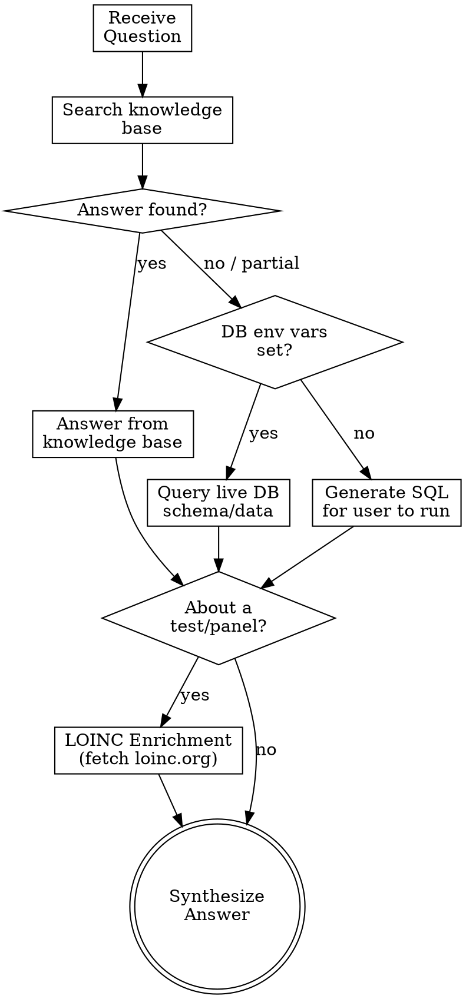

# Explore OpenLDR Data

Answer any question about the OpenLDR laboratory data system — schema, panel codes, table relationships, data model, facility hierarchy, and more.

**Announce:** "I'm using the openldr:explore skill to look into OpenLDR data."

## Process



## Step 1: Search Knowledge Base

Read `references/openldr-schema-guide.md` to find the answer. This contains:

- **Database overview** — OpenLDRData and OpenLDRDict databases, design principles
- **Table schemas** — all columns, data types, nullability, HL7 mappings for Requests, LabResults, Monitoring, ASTResults, Patients, VersionControl
- **Dictionary tables** — Facilities, HealthcareAreas, Laboratories, HFLattLong, DisaPoc, DisaLink, viewFacilities, HL7 reference tables, LOINC, MDRCodes
- **Relationships** — composite key structure (RequestID → OBRSetID → OBXSetID), facility chain, cross-database references
- **Panel codes** — all known LIMSPanelCodes with observation codes and descriptions
- **Views and functions** — existing SQL views and user-defined functions
- **Facility hierarchy** — Country → Province → Region → District → Sub-District → Facility
- **HL7 code lookups** — sex codes, result status, specimen sources, abnormal flags
- **Analytics datasets** — VlData, EIDMaster, TBMaster schemas

If the knowledge base fully answers the question, respond directly. Include relevant column names, data types, and relationships.

## Step 2: Query Live Database

<HARD-GATE>
When the knowledge base does NOT have the answer, you MUST attempt to query the live database before giving up. Do NOT skip this step. Do NOT tell the user to run SQL manually if the script is available. Always try the script first.
</HARD-GATE>

Database connectivity is critical for this skill. The query script loads credentials automatically from `.env` files and supports multiple SQL clients (sqlcmd, python3+pyodbc).

### Always attempt the query first

Run the query helper script. It handles credential loading and client detection automatically:

```bash
# Discover tables
../openldr-create-view/scripts/query-db.sh query dict "SELECT TABLE_NAME, TABLE_TYPE FROM INFORMATION_SCHEMA.TABLES ORDER BY TABLE_NAME"

# Get column details for a table
../openldr-create-view/scripts/query-db.sh query data "SELECT COLUMN_NAME, DATA_TYPE, IS_NULLABLE, CHARACTER_MAXIMUM_LENGTH FROM INFORMATION_SCHEMA.COLUMNS WHERE TABLE_NAME = '{TABLE}' ORDER BY ORDINAL_POSITION"

# Get panel codes (with LOINC mapping)
../openldr-create-view/scripts/query-db.sh query dict "SELECT DISTINCT LIMSPanelCode, LOINCPanelCode, LIMSPanelDesc FROM LIMSPanelCodes ORDER BY LIMSPanelCode"

# Get observation codes for a panel
../openldr-create-view/scripts/query-db.sh observations {PANEL_CODE}

# Sample data
../openldr-create-view/scripts/query-db.sh query data "SELECT TOP 5 * FROM {TABLE}"

# Row counts
../openldr-create-view/scripts/query-db.sh query data "SELECT COUNT(*) AS row_count FROM {TABLE}"

# Indexes
../openldr-create-view/scripts/query-db.sh query data "SELECT name, type_desc FROM sys.indexes WHERE object_id = OBJECT_ID('{TABLE}')"

# Foreign keys
../openldr-create-view/scripts/query-db.sh query data "SELECT fk.name, OBJECT_NAME(fk.parent_object_id) AS [table], OBJECT_NAME(fk.referenced_object_id) AS [referenced] FROM sys.foreign_keys fk"

# Views
../openldr-create-view/scripts/query-db.sh query data "SELECT TABLE_NAME FROM INFORMATION_SCHEMA.VIEWS ORDER BY TABLE_NAME"

# Functions
../openldr-create-view/scripts/query-db.sh query data "SELECT name, type_desc FROM sys.objects WHERE type IN ('FN','IF','TF') ORDER BY name"
```

### Only if the script fails

If the script returns an error about missing credentials or no SQL client:
1. Check if `~/.openldr.env` or `$PWD/.env` exists — if not, help the user create one
2. Check if `sqlcmd` or `pyodbc` is available — if not, suggest installation
3. As a **last resort**, generate the SQL query for the user to run manually

## Step 3: LOINC Enrichment

When the question is about a specific **test type or panel code**, enrich the answer with official LOINC documentation. This provides clinical context — what the test measures, specimen requirements, methodology, and standardized naming.

### How to get the LOINC code

The `LIMSPanelCodes` table in OpenLDRDict has a `LOINCPanelCode` column that maps each LIMSPanelCode to its corresponding LOINC code.

**Known mappings** (from knowledge base):

| LIMSPanelCode | LOINCPanelCode | Test |
|---------------|----------------|------|
| HIVVL | 25836-8 | HIV 1 RNA (Viral Load) |
| VIRAL | 25836-8 | HIV 1 RNA (Viral Load) — registration metadata |
| PCR | 9836-8 | HIV 1 DNA (EID Qualitative PCR) |
| FSR | 9836-8 | HIV 1 DNA (EID) — registration metadata |
| PCRGX | 38376-3 | MTB DNA (TB GeneXpert) |
| CD4 | 24467-3 | CD4 Count |
| CRAG | 31795-8 | Cryptococcal Antigen |
| TBLAM | 94053-5 | TB LAM Antigen |

**If the LOINC code is not in the knowledge base**, look it up from the live DB:

```bash
../openldr-create-view/scripts/query-db.sh query dict "SELECT DISTINCT LIMSPanelCode, LOINCPanelCode, LIMSPanelDesc FROM LIMSPanelCodes WHERE LIMSPanelCode = '{PANEL_CODE}'"
```

### Fetch LOINC details

Once you have the LOINC code, fetch the official documentation from loinc.org using the WebFetch tool:

```
WebFetch: https://loinc.org/{LOINC_CODE}
```

For example: `https://loinc.org/25836-8` for HIV Viral Load.

### What to extract from loinc.org

Parse the fetched page and extract:
- **Long Common Name** — the full standardized test name
- **Component** — what is being measured (e.g., "HIV 1 RNA")
- **Property** — measurement property (e.g., "NCnc" = number concentration)
- **System** — specimen type (e.g., "Ser/Plas" = serum or plasma)
- **Method** — testing methodology (e.g., "Probe.amp.tar" = nucleic acid amplification)
- **Scale** — quantitative, ordinal, nominal
- **Class** — laboratory section (e.g., "MICRO" = microbiology)
- **Status** — active or deprecated
- **Related Names** — alternative names and synonyms

### When to enrich

| Question Type | Enrich with LOINC? |
|---------------|-------------------|
| "What is the VIRAL panel?" | Yes — explain what VL measures clinically |
| "What columns does Requests have?" | No — schema question, not test-specific |
| "Tell me about HIV EID testing" | Yes — explain PCR methodology and purpose |
| "How are facilities organized?" | No — structural question |
| "What does PCRGX test for?" | Yes — explain TB GeneXpert detection |
| "What panels are available?" | Yes — list panels with LOINC descriptions |

### If LOINC fetch fails

If loinc.org is unreachable or the page doesn't contain useful information, still answer from the knowledge base. Mention the LOINC code for reference: "The LOINC code for this test is 25836-8 — you can look it up at https://loinc.org/25836-8 for detailed clinical information."

## Step 4: Synthesize Answer

Present the answer clearly:
- Use markdown tables for schema information
- Show relationships with simple diagrams when helpful
- Include relevant column names, data types, and constraints
- Explain domain-specific terms in plain language (e.g., "OBRSetID is the panel sequence number — a single blood sample can have multiple test panels")
- When LOINC enrichment was performed, include the clinical context: what the test measures, specimen type, methodology, and the LOINC code with a link to loinc.org
- Suggest related questions or next steps (e.g., "You might also want to explore the viewFacilities view which joins Facilities with HealthcareAreas")
- If the question leads to creating views or datasets, suggest the appropriate skill (`openldr:create-view` or `openldr:create-dataset`)

## Question Categories

| Category | Knowledge Base | Live DB | Example Questions |
|----------|---------------|---------|-------------------|
| Table schemas | Yes | For new/modified tables | "What columns does Requests have?" |
| Panel codes | Yes (9 panels) | For new panels | "What panels are available?" |
| Observation codes | Yes | For new codes | "What does ENCON mean?" |
| Relationships | Yes | Rarely needed | "How do Requests and LabResults connect?" |
| Facility hierarchy | Yes | For current data | "How are facilities organized?" |
| HL7 code meanings | Yes | Rarely needed | "What does HL7ResultStatusCode F mean?" |
| Row counts / data stats | No | Required | "How many requests are in the DB?" |
| Indexes / constraints | No | Required | "What indexes exist on LabResults?" |
| Current data values | No | Required | "What are the top panel codes by volume?" |
| Analytics datasets | Yes | For verification | "What columns does VlData have?" |
| Custom tables / views | Partial | Required | "Is there a view called viewCD4?" |
| Test/panel details | Yes + LOINC | For unknown panels | "What does the VIRAL panel test for?" |
| LOINC code lookup | Via LOINCPanelCode | For mapping | "What is the LOINC code for GeneXpert?" |
