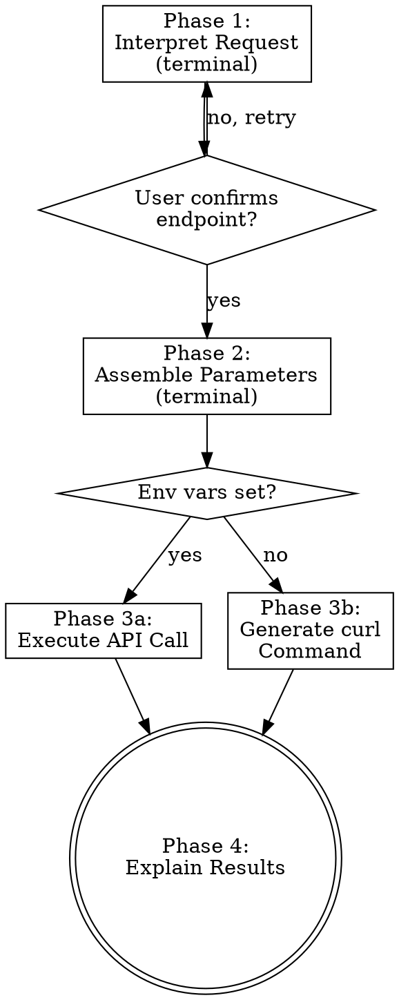

# Query OpenLDR Analytics API

Translate natural language requests into OpenLDR API calls. Identify the correct endpoint, build parameters, execute (or generate curl), and explain results.

**Announce:** "I'm using the openldr:query-api skill to query the OpenLDR Analytics API."

## Process



## Phase 1: Interpret Request

Load `references/prompt-to-endpoint-guide.md` and follow the 4-step decision tree:

1. **Disease/test type** → module path (`/hiv/vl/`, `/hiv/eid/`, `/tb/gx/`, `/dict/`, `/auth/`)
2. **View perspective** → path segment (`/laboratories/`, `/facilities/`, `/summary/`, `/patients/`)
3. **Metric type** → endpoint suffix (`tested_samples`, `rejected_samples`, `suppression`, `tat`, etc.)
4. **Time granularity** → `_by_month` suffix or base variant

Present the matched endpoint with reasoning. Ask user to confirm before proceeding.

If unsure between endpoints, load `references/api-endpoint-catalog.md` for the full endpoint list.

## Phase 2: Assemble Parameters

Build the query string. Standard parameters (most endpoints accept all of these):

| Parameter | Format | Required | Example |
|-----------|--------|----------|---------|
| `interval_dates` | `YYYY-MM-DD` (two values) | Recommended | `interval_dates=2024-01-01&interval_dates=2024-12-31` |
| `province` | Province name (multi-value) | No | `province=Maputo&province=Gaza` |
| `district` | District name (multi-value) | No | `district=Matola` |
| `health_facility` | Facility name | No | `health_facility=HG Machava` |
| `facility_type` | `province`/`district`/`health_facility` | No | `facility_type=province` |
| `disaggregation` | `True`/`False` | No | `disaggregation=True` |

**Multi-value params use repeated keys**, NOT comma-separated:
```
CORRECT: ?province=Maputo&province=Gaza
WRONG:   ?province=Maputo,Gaza
```

**Module-specific parameters:**
- HIV EID: `lab_type` (`conventional`, `poc`, `all`)
- TB GeneXpert: `genexpert_result_type` (`Ultra 6 Cores`, `XDR 10 Cores`), `type_of_laboratory`
- TB Patients: `first_name`, `surname`, `page`, `per_page`

Show the assembled URL for user confirmation.

**Valid province names (Mozambique):** Cabo Delgado, Gaza, Inhambane, Manica, Maputo, Maputo Cidade, Nampula, Niassa, Sofala, Tete, Zambezia

## API Connectivity

**Credentials** are loaded automatically from (first match wins):
1. `.env` in the current working directory (project-specific)
2. `~/.openldr.env` (global — works from any directory)
3. Shell environment variables (from `~/.bashrc` etc.)

Create a `.env` file with:
```
OPENLDR_API_URL=https://dev.openldr.org.mz
OPENLDR_API_USER=your_username
OPENLDR_API_PASSWORD=your_password
```

**Helper script** — `scripts/query-api.sh` handles authentication and API calls:

```bash
scripts/query-api.sh test                              # Test API connectivity
scripts/query-api.sh login                             # Get JWT token
scripts/query-api.sh get "/hiv/vl/summary/header_indicators/?interval_dates=2024-01-01&interval_dates=2024-12-31"
scripts/query-api.sh get-noauth "/dict/facilities/"    # Dict endpoints (no auth)
```

## Phase 3: Execute or Explain

### If env vars are set

Use `scripts/query-api.sh` to execute the API call:

1. **Dictionary endpoints** (`/dict/*`): run `scripts/query-api.sh get-noauth "{endpoint}"` (no auth needed)
2. **All other endpoints**: run `scripts/query-api.sh get "{endpoint}?{params}"` (auto-authenticates)
3. On 401 (expired): the script re-authenticates once automatically
4. Parse JSON response and proceed to Phase 4

**Security:** Never log, display, or store credentials. The script reads from env vars each time.

### If env vars are NOT set (fallback)

Generate the complete curl command:

```bash
# Step 1: Get token
curl -X POST {api_url}/auth/login \
  -H "Content-Type: application/json" \
  -d '{"username": "YOUR_USER", "password": "YOUR_PASS"}'

# Step 2: Query endpoint
curl -X GET "{api_url}{endpoint}?{params}" \
  -H "Authorization: Bearer YOUR_TOKEN"
```

Explain the expected response structure and what each field means.

Suggest creating a `.env` file or `~/.openldr.env` for automatic execution:
```
OPENLDR_API_URL=https://dev.openldr.org.mz
OPENLDR_API_USER=your_username
OPENLDR_API_PASSWORD=your_password
```

## Phase 4: Explain Results

When results are available:
- Present data in a readable format (markdown tables)
- Highlight key findings (e.g., "Gaza has 92% viral suppression")
- Explain domain-specific metrics in plain language
- Suggest related endpoints for deeper analysis

## Error Handling

| Status | Meaning | Action |
|--------|---------|--------|
| 200 | Success | Parse and explain data |
| 401 | Unauthorized/expired | Re-authenticate once, then report |
| 400 | Bad request | Check parameters, suggest fixes |
| 500 | Server error | Report and suggest trying later |
| Empty data | No results for filters | Suggest widening date range or removing filters |
